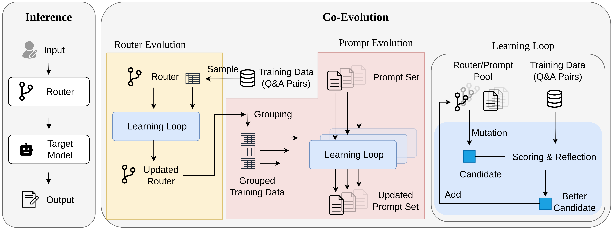
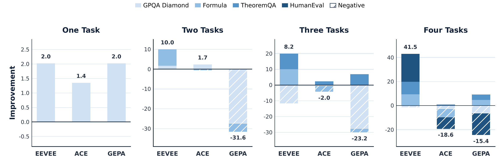

# EEVEE

<p align="center">
  
</p>

<p align="center">
  <b>Towards Test-time Prompt Learning in the Real World for Self-Improving Agents</b>
</p>

<p align="center">
  <a href="https://princeton-ai2-lab.github.io/EEVEE/">Website</a> |
  <a href="https://github.com/Princeton-AI2-Lab/EEVEE">Code</a> |
  <a href="assets/paper.pdf">Paper</a>
</p>

EEVEE is a multi-dataset test-time prompt learning framework for LLM agents. It targets realistic task streams where inputs come from multiple datasets, domains, and evaluation formats instead of one stationary benchmark.

The core idea is to learn a router-conditioned prompt set. The router assigns each input to a specialized prompt slot, and EEVEE improves the router and prompt set together through router-prompt co-evolution.

The project website includes the video overview.

## Highlights

- Learns prompt specialization for heterogeneous task streams.
- Uses a router to reduce cross-dataset interference between task families.
- Alternates router evolution and prompt evolution under downstream validation feedback.
- Supports OpenAI-compatible chat completion APIs through `provider:model` specs.

## Framework

<p align="center">
  
</p>

At inference time, EEVEE routes an input to one prompt slot and queries the target model with the selected prompt. During learning, it alternates router and prompt updates so that routing decisions and prompt quality improve under the same downstream objective.

## Results Snapshot

<p align="center">
  
</p>

In the paper, EEVEE improves average multi-benchmark scores by 10.38 and 24.32 points over Qwen3-4B-Instruct and DeepSeek-V3.2, and outperforms GEPA and ACE by up to 37.2% and 48.2%. See the [paper](assets/paper.pdf) for the full evaluation, ablations, and analysis.

Main results on the four-benchmark suite. Scores are percentages averaged over three runs.

| Target Model | Method | GPQA Diamond | Formula | TheoremQA | HumanEval | Avg. |
| --- | --- | ---: | ---: | ---: | ---: | ---: |
| Qwen3-4B-Instruct | Baseline | 56.00 | 45.22 | 14.79 | 49.46 | 41.37 |
| Qwen3-4B-Instruct | ACE | 48.93 | 39.67 | 15.84 | 35.23 | 34.92 |
| Qwen3-4B-Instruct | GEPA | 50.84 | 49.83 | 19.62 | 30.62 | 37.73 |
| Qwen3-4B-Instruct | **EEVEE** | **54.55** | **54.55** | **25.27** | **72.63** | **51.75** |
| DeepSeek-V3.2 | Baseline | 64.98 | 30.00 | 21.21 | 42.82 | 39.75 |
| DeepSeek-V3.2 | ACE | 55.89 | 37.78 | 27.05 | 78.59 | 49.83 |
| DeepSeek-V3.2 | GEPA | 41.75 | 60.56 | 31.72 | 89.29 | 55.83 |
| DeepSeek-V3.2 | **EEVEE** | **63.08** | **60.55** | **39.84** | **92.82** | **64.07** |

## How to Start

```bash
git clone https://github.com/Princeton-AI2-Lab/EEVEE.git
cd EEVEE

python -m venv .venv
source .venv/bin/activate
pip install -r requirements.txt
```

Prepare the benchmarks and model specs following the [usage guide](docs/usage.md), then run:

```bash
export OPENROUTER_API_KEY="..."
python main.py configs/demo.yaml
```

The usage guide also covers smoke tests, output artifacts, and repository layout.

## Citation

If you use EEVEE, please cite:

```bibtex
@misc{xu2026eevee,
  title = {Eevee: Towards Test-time Prompt Learning in the Real World for Self-Improving Agents},
  author = {Xu, Weixian and Liu, Shilong and Wang, Mengdi},
  year = {2026},
  note = {Preprint}
}
```

## License

This project is released under the Apache License 2.0. See [`LICENSE`](LICENSE).
