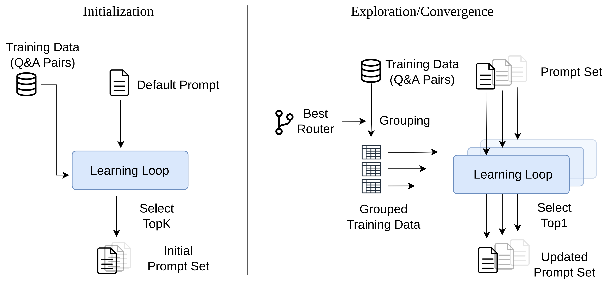

# EEVEE Usage Guide

This guide covers practical setup details: model configuration, data layout, important parameters, smoke tests, and run artifacts.

## Installation

Create and activate a Python environment:

```bash
git clone https://github.com/Princeton-AI2-Lab/EEVEE.git
cd EEVEE

python -m venv .venv
source .venv/bin/activate
python -m pip install --upgrade pip
pip install -r requirements.txt
```

On Windows PowerShell:

```powershell
python -m venv .venv
.venv\Scripts\Activate.ps1
python -m pip install --upgrade pip
pip install -r requirements.txt
```

## Model Configuration

EEVEE uses model specs in this form:

```text
provider:model_name
```

The default config is [`configs/demo.yaml`](../configs/demo.yaml). Replace the placeholder model names before running:

```yaml
models:
  generator: "openrouter:MODEL_NAME"
  router: "openrouter:MODEL_NAME"
  prompt_mutation: "openrouter:MODEL_NAME"
  prompt_reflection: "openrouter:MODEL_NAME"
  router_mutation: "openrouter:MODEL_NAME"
  router_analysis: "openrouter:MODEL_NAME"
  router_reflection: "openrouter:MODEL_NAME"
  judge: "openrouter:MODEL_NAME"
```

Supported API providers include:

| Provider | Environment variable |
| --- | --- |
| `openrouter` | `OPENROUTER_API_KEY` |
| `openai` | `OPENAI_API_KEY` |
| `deepseek` | `DEEPSEEK_API_KEY` |
| `sambanova` | `SAMBANOVA_API_KEY` |
| `sglang` | local OpenAI-compatible endpoint |

For example:

```bash
export OPENROUTER_API_KEY="..."
```

On Windows PowerShell:

```powershell
$env:OPENROUTER_API_KEY="..."
```

Optional decoding parameters can be configured in [`configs/api_params_config.json`](../configs/api_params_config.json). Model-specific entries are matched by key, and `default` is used as the fallback.

## Datasets

`configs/demo.yaml` uses the following processed files:

| Task | Source | Output path |
| --- | --- | --- |
| GPQA Diamond | [Idavidrein/gpqa](https://huggingface.co/datasets/Idavidrein/gpqa) | `tasks/gpqa/data/gpqa_diamond.jsonl` |
| Formula | [Open-Finance-Lab/FinLoRA](https://github.com/Open-Finance-Lab/FinLoRA) | `tasks/formula/data/formula_train.jsonl`, `tasks/formula/data/formula_test.jsonl` |
| TheoremQA | [TIGER-Lab/TheoremQA](https://huggingface.co/datasets/TIGER-Lab/TheoremQA) | `tasks/theorem_qa/data/theorem_qa_test.jsonl` |
| HumanEval | [openai/openai_humaneval](https://huggingface.co/datasets/openai/openai_humaneval) | `tasks/humaneval/data/humaneval.jsonl` |

Prepare the default benchmarks:

```bash
huggingface-cli login
python tasks/gpqa/prepare_gpqa_data.py --subset diamond
python tasks/formula/prepare_formula_data.py
python tasks/theorem_qa/prepare_theorem_qa_data.py
python tasks/humaneval/prepare_humaneval_data.py
```

GPQA is gated on Hugging Face; approve access on the dataset page before running the script. The other scripts fetch from the upstream sources listed above.

Additional held-out benchmarks:

| Task | Source | Output path |
| --- | --- | --- |
| MBPP | [google-research-datasets/mbpp](https://huggingface.co/datasets/google-research-datasets/mbpp) | `tasks/mbpp/data/mbpp-train.jsonl`, `tasks/mbpp/data/mbpp-test.jsonl` |
| MMLU-Pro | [TIGER-Lab/MMLU-Pro](https://huggingface.co/datasets/TIGER-Lab/MMLU-Pro) | `tasks/mmlu_pro/data/mmlu_pro-all.jsonl` |

```bash
python tasks/mbpp/prepare_mbpp_data.py
python tasks/mmlu_pro/prepare_mmlu_pro_data.py
```

## Running

After model and data setup:

```bash
python main.py configs/demo.yaml
```

The run directory is created under:

```text
results/<timestamp>_<experiment_name>/
```

## Repository Layout

```text
.
|-- main.py              # CLI entry point
|-- configs/             # Experiment and API parameter configs
|-- evolve/              # EEVEE pipeline, stages, agents, pools, and runtime utilities
|-- infer/               # Generator and router inference wrappers
|-- prompts/             # Jinja templates for mutation, reflection, analysis, and routing
|-- tasks/               # Task plugins, evaluators, prompts, and data preparation scripts
|-- utils/               # API clients, logging, parsing, sampling, and artifact helpers
|-- assets/              # Paper and README figures
`-- docs/                # Usage and configuration documentation
```

## Smoke Test

For a quick low-cost check, copy `configs/demo.yaml` and reduce the budgets:

```yaml
data:
  max_benchmark_items: 20

initialization:
  prompt_evolve_budget: 2

exploration:
  total_mini_step_budget: 4

convergence:
  prompt_evolve_budget_per_slot: 2

execution:
  eval_workers: 4
  router_workers: 4
  test_workers: 4
```

Then run:

```bash
python main.py configs/smoke.yaml
```

## Key Configuration Fields

| Field | Purpose |
| --- | --- |
| `experiment_name` | Name suffix for the run directory. |
| `save_path` | Root directory for run outputs. |
| `models` | Model specs for generator, router, mutation, reflection, analysis, and judge roles. |
| `api_params_config` | Optional JSON file with generation parameters. |
| `tasks` | List of task names, modes, and judge modes to load. |
| `data.max_benchmark_items` | Maximum number of examples sampled per benchmark before splitting. |
| `data.split_ratio` | Train/test split ratio when a task does not provide separate splits. |
| `data.val_ratio_from_train` | Fraction of training examples held out for validation. |
| `data.benchmark_mode` | If true, uses the full benchmark test split when available. |
| `prompt_set_size` | Number of specialized prompt slots. |
| `initialization.prompt_evolve_budget` | Budget for building the initial prompt pool. |
| `exploration.total_mini_step_budget` | Total budget for alternating router and prompt exploration. |
| `exploration.router_window_size` | Router phase window before checking whether to switch phases. |
| `exploration.prompt_window_size` | Prompt phase window before checking whether to switch phases. |
| `exploration.phase_switch_epsilon` | Minimum improvement threshold for phase switching. |
| `router.temporary_pool_max_size` | Maximum temporary router pool size. |
| `router.score_weights` | Router scoring weights during exploration. |
| `router.final_score_weights` | Router scoring weights near the end of exploration. |
| `convergence.prompt_evolve_budget_per_slot` | Final prompt learning budget for each routed slot. |
| `prompt.minibatch_size` | Number of examples per prompt-evolution minibatch. |
| `prompt.max_parallel_slots` | Maximum number of prompt slots evolved in parallel. |
| `execution.eval_workers` | Worker count for evaluation calls. |
| `execution.router_workers` | Worker count for router calls. |
| `execution.test_workers` | Worker count for final test calls. |
| `execution.test_repeats` | Number of repeated final test evaluations. |
| `execution.max_prompt_length` | Maximum prompt length retained by agents. |
| `execution.max_retry` | Retry count for API calls. |
| `logging.llm_call_log` | If true, stores detailed LLM call logs. |
| `logging.wandb.enabled` | Enables optional Weights & Biases logging. |

## Output Artifacts

Important files in each run directory:

```text
run_log.txt                  # Human-readable run summary
events.jsonl                 # Structured event stream
initial_test_results.json    # Empty-prompt baseline results
best_candidate.json          # Best learned router and prompt set
final_test_results.json      # Final per-task test results
final_test_routes.jsonl      # Router decisions on test examples
dev_artifact_manifest.json   # Artifact index
eval_cache.json              # Cached generations and correctness results
```

## Adding a Task

Add a new folder under `tasks/` with:

```text
tasks/<task_family>/
|-- task.yaml
|-- data_worker.py
`-- prompt.jinja
```

`task.yaml` should declare a family name, processor class, task names, and split paths:

```yaml
family: my_task
processor: tasks.my_task.data_worker:DataProcessor
tasks:
  my_task:
    train_data: ./tasks/my_task/data/train.jsonl
    test_data: ./tasks/my_task/data/test.jsonl
```

The data processor should normalize raw JSONL examples into the fields expected by the evaluator and prompt template. See existing task folders for examples.

## Training Stages

<p align="center">
  
</p>

EEVEE uses three stages:

1. **Initialization:** learns a diverse pool of prompts and selects prompt slots with complementary validation coverage.
2. **Exploration:** alternates lightweight router and prompt evolution to search over coupled designs.
3. **Convergence:** fixes the stabilized router and spends a larger budget improving each routed prompt slot.
